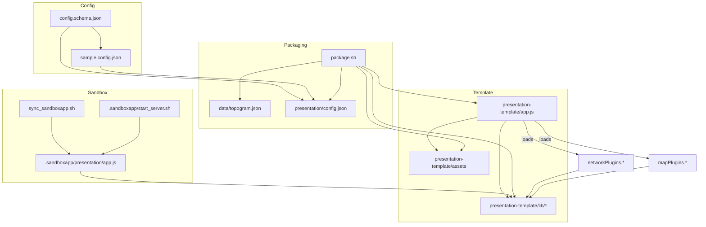

# MapApp Builder

The `mapappbuilder/` workspace contains everything that is needed to turn a single Topogram
graph into a self-contained, static bundle. The exported bundle ships:

- serialized nodes, edges and metadata;
- a configurable presentation shell that can render both a network view and an optional
	geomap view; and
- the runtime dependencies required to run offline (React, Reagraph, Cytoscape, Leaflet,
	etc.), with CDN fallbacks when a library is not bundled.

While the original goal was to provide a lightweight skeleton, the folder now implements a
complete packaging workflow with a testing sandbox and renderer adapters that mirror the
behaviour of the main Topogram application.

## Folder layout

```
mapappbuilder/
├── config.schema.json        # JSON Schema describing the exported bundle configuration
├── sample.config.json        # Example configuration compatible with the schema
├── presentation-template/    # Source template copied into exported bundles
├── .sandboxapp/              # Runnable sandbox for local testing of the template
├── MAP_RENDERERS.md          # Detailed notes on the shipped map plugins
├── NETWORK_RENDERERS.md      # Detailed notes on the shipped network plugins
├── package.sh                # Packaging helper invoked by CI or manual workflows
├── sync_sandboxapp.sh        # Rsync helper to mirror the template into .sandboxapp/
├── tmp-check-reagraph.js     # Utility script for inspecting the Reagraph bundle in Node
└── mapappbuilder_specifics.md# Additional branch notes for contributors
```

Key runtime files inside `.sandboxapp/presentation/`:

- `app.js` — the presentation loader that wires configuration, renderers and DOM bootstrapping;
- `lib/` — locally bundled UMD builds (Reagraph + peers, Cytoscape, Sigma, Leaflet, Cesium,
	MapLibre) that are preferred over CDN copies; and
- `config.json` / `data/topogram.json` — generated during packaging and consumed by the loader.

## Build and packaging workflow

1. **Prepare configuration** — build a JSON object that satisfies `config.schema.json`. The
	 schema enforces renderer names, dataset metadata, layout hints and optional UI toggles.
2. **Export dataset** — the main Topogram application writes the selected graph into
	 `presentation/data/topogram.json` and emits `presentation/config.json`.
3. **Sync template (optional)** — `./sync_sandboxapp.sh` mirrors
	 `presentation-template/` into `.sandboxapp/presentation/` for rapid testing.
4. **Smoke-test locally** — `./.sandboxapp/start_server.sh --network reagraph` (or the
	 renderer you need) serves the sandbox on `http://localhost:3024`.
5. **Package** — `./package.sh <output.zip>` copies the template, injects config/data and
	 zips the folder. The script keeps the `lib/` directory intact so bundles remain
	 self-contained.

The workflow is filesystem-only: no Meteor server is required at runtime.

Note on branches

When you work on the `mapappbuilder` Git branch, keep changes scoped to `mapappbuilder/` and `.sandboxapp/`. Do not modify the core Topogram app in that branch — this ensures clean diffs and easy rebases with `main`. The builder is designed to evolve independently of the Meteor client/server.

## Configuration schema highlights

`config.schema.json` documents every field. The most commonly used keys are:

- `metadata.title`, `metadata.description`, `metadata.generatedAt` — populate hero content.
- `networkRenderer` and `mapRenderer` — select the active plugins (`cytoscape`, `sigma`,
	`reagraph` for networks; `leaflet`, `maplibre`, `cesium` for maps).
- `networkOptions` — layout hints (`layoutType`, `layoutIterations`), UI tweaks
	(`interactionMode`, `labelType`, `cameraMode`).
- `mapOptions` — map centring, tile overrides, and per-renderer settings.
- `assets` — map of additional static files to ship with the bundle.

Use `sample.config.json` as a starting point; it exercises every section of the schema.

## Presentation runtime

`app.js` inside the presentation is responsible for:

1. Loading configuration and dataset JSON.
2. Detecting data characteristics (presence of geo coordinates, node/edge attributes).
3. Loading renderer dependencies via `ensureGlobal(...)`, favouring local UMD builds in
	 `presentation/lib/` before falling back to CDN URLs.
4. Normalising nodes and edges so that each renderer receives consistent IDs, labels,
	 sizing attributes and colours.
5. Instantiating the selected renderers through `mapPlugins` and `networkPlugins`.

### Reagraph integration

- Reagraph is bundled locally as `presentation/lib/reagraph.umd.js`, together with the
	`React 19` and `graphology` peers it expects.
- The loader now resolves the GraphCanvas component from `window.reagraph` (or
	`window.reagraphBundle`) and renders it via `ReactDOMClient.createRoot` when available.
- Graph data is built through `reagraph.buildGraph(...)`, using `graphology` when available
	and falling back to Reagraph’s internal builder.
- Layout selection honours `networkOptions.layoutType` with a safe default
	(`forceDirected2d`) and logs helpful debug output through `console.debug`.

### Cytoscape & Sigma integration

- Cytoscape receives normalised `elements` with per-node and per-edge styling rules that
	mirror the main Topogram UI (weight and colour mapping, parallel edge offsets, label text).
- Sigma receives a lightweight in-memory graph (`{ nodes: [], edges: [] }`) suitable for
	quick inspection or embedding when Cytoscape is not required.

### Map renderers

- Leaflet, MapLibre and Cesium adapters are provided. Each adapter reads geo coordinates
	through the `readField` helper so both flat and nested node structures work.
- Leaflet is tuned for offline use by rewriting icon URLs to point at `presentation/lib/images`.
- Cesium sets `window.CESIUM_BASE_URL` so the packaged assets resolve correctly when served
	from any location.

Refer to `NETWORK_RENDERERS.md` and `MAP_RENDERERS.md` for extensive per-renderer notes.

## Sandbox workflow

The `.sandboxapp/` directory mirrors the final bundle layout and exposes a simple static
server for manual QA:

```bash
cd mapappbuilder
./sync_sandboxapp.sh             # copy presentation-template → .sandboxapp/presentation
./.sandboxapp/start_server.sh    # serve on http://localhost:3024 (defaults to Reagraph)
```

Query parameters let you quick-switch renderers without editing config files:
`?network=cytoscape`, `?network=sigma`, `?geomap=leaflet`, etc.

## Dependency graph

See `mapappbuilder/DEPENDENCY_GRAPH.md` for the complete diagram and narrative. The quick
summary below highlights the core relationships on a single page:



## Tips and gotchas

- **Keep `presentation/lib/` in sync.** When upgrading Reagraph or React, rebuild the UMD
	bundle and copy it to `presentation-template/lib/` as well as `.sandboxapp/presentation/lib/`.
- **Mind configuration IDs.** Nodes and edges must resolve to string IDs. The loader already
	normalises `_id` and nested `data.id` fields, but ensure your export preserves them.
- **Use the debug logs.** The loader now emits `[reagraph]` logs with node/edge counts,
	layout names and graphology detection — handy when comparing behaviour with the main app.
- **Sandbox is authoritative.** Every change should be verified in `.sandboxapp/` before
	packaging; `sync_sandboxapp.sh` is cheap to run and prevents stale assets from being zipped.

For deeper dives, read the renderer notes (`NETWORK_RENDERERS.md`, `MAP_RENDERERS.md`) and the
branch-specific guidelines in `mapappbuilder_specifics.md`.
